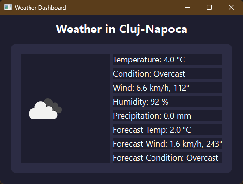

# Weather Dashboard

A modern desktop weather application built with **Python** and **PyQt5**. It fetches weather data from [Open-Meteo](https://open-meteo.com/) and displays current conditions along with hourly forecasts. The app features **web-based weather icons**, a clean dark UI, and all key weather metrics.

---

## Features

- Fetches user location automatically using IP geolocation
- Displays:
  - Temperature
  - Weather condition
  - Wind speed and direction
  - Humidity
  - Precipitation
  - Hourly forecast for temperature, wind, and condition
- Simple, sleek UI with rounded panels and web-based icons
- Lightweight and fully standalone (no local icons required)

---

## Screenshots



---

## Installation

1. **Clone the repository:**

```bash
git clone https://github.com/ssbodea/Weather-App.git
cd Weather-App

# On Windows
python -m venv venv
venv\Scripts\activate

# On Linux/Mac
python3 -m venv venv
source venv/bin/activate

pip install -r requirements.txt
